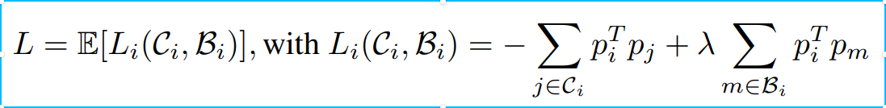
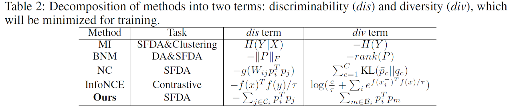

## (NeurIPS 2022) Attracting and Dispersing: A Simple Approach for Source-free Domain Adaptation

##### _Shiqi Yang, Yaxing Wang, Kai Wang, Shangling Jui and Joost van de Weijer_

------------
Code for our paper **'Attracting and Dispersing: A Simple Approach for Source-free Domain Adaptation'** 

[[project]](https://sites.google.com/view/aad-sfda)[[arxiv]](https://arxiv.org/abs/2205.04183)

### Contributions
- We provide a _surprisingly simple_ solution for source-free domain adaptation, which is an upperbound of the proposed clustering objective:

- And we can relate several methods in domain adaptation, source-free domain adaptation and contrastive learning via the perspective of discriminability and diversity:

### code on VisDA
**We use pytoch 1.3 with cuda 10.0**

**Attention: Please note that the kl_div in pytorch equals to dot product if there is no log for the input.**

Download VisDA dataset and change the path in the code to it.
First train model on Source domain, directly run src_pretrain.py
Source-free domain adaptation, directly run tar_adaptation.py

**For more datasets, you can insert the core part (loss computing starting in [Line 297](https://github.com/Albert0147/AaD_SFDA/blob/9a4c8bf9bfb6ab0800be55163c82d8ee71e7e6be/tar_adaptation.py#L297) in tar_adaptation.py) into code of our [NRC](https://github.com/Albert0147/NRC_SFDA) (NeurIPS 2021)**

For computing SND, you can use the file snd.py (code is from [SND](https://github.com/VisionLearningGroup/SND)), in the paper we compute SND after only training for a few epochs (~5 on visda).

